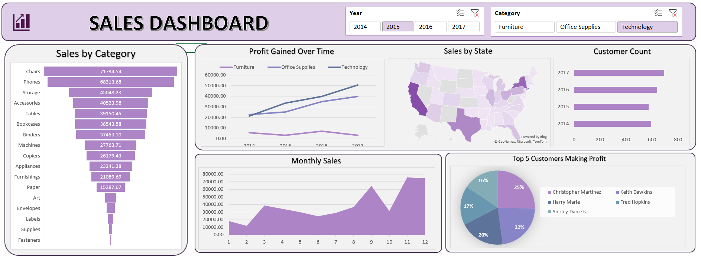

## Project Overview

This project involves analyzing sales data (2014-2017) to identify trends, top-performing products, and key revenue drivers across the United States. The final output is an interactive excel dashboard featuring a cohesive purple-themed UI that allows stakeholders to filter data by year and category.
The goal was to transform raw sales data into a visual narrative to assist in understanding customer behavior and regional performance.

## Dashboard Preview

## 📂 Key Features & Visualizations

The dashboard includes the following dynamic visualizations:

1.  **Sales by Category (Funnel Chart):** A breakdown of sales volume by sub-category, highlighting top performers like Chairs and Phones vs. lower performers like Fasteners.
2.  **Profit Gained Over Time (Line Chart):** A multi-line chart comparing profit trends across Furniture, Office Supplies, and Technology over the 4-year period.
3.  **Sales by State (Map Chart):** A geospatial heatmap visualizing sales concentration across the US, identifying key markets (e.g., California, New York).
4.  **Customer Count (Bar Chart):** Tracks the growth of the unique customer base from 2014 to 2017.
5.  **Monthly Sales (Area Chart):** visualizes seasonality and sales fluctuations throughout the year.
6.  **Top 5 Customers (Pie Chart):** Identifies the most profitable individual clients to aid in customer relationship management.

## 🛠️ Tools & Technologies Used

 **Microsoft Excel:** Core tool for data analysis and visualization.
**Pivot Tables:** Used to summarize raw data for the dashboard charts.
 **Slicers:** Interactive filters added for "Year" and "Category" to make the dashboard dynamic.
 **Data Cleaning:** Standardized data types and removed duplicates to ensure accuracy.

---

## 🔍 Key Insights Derived

Based on the dashboard analysis:
* **Product Performance:** *Technology* is the leading category in terms of profit growth over time, sharply increasing towards 2017.
* **Regional Trends:** Sales are heavily concentrated in coastal states (California, New York) and Texas, while central states show lower activity.
* **Customer Growth:** There has been a consistent year-over-year increase in the customer base, peaking in 2017.
* **Seasonality:** The "Monthly Sales" chart indicates significant spikes in sales activity towards the end of the year (likely Q4/Holiday season).

---

## 🚀 How to Use
1.  **Download** the Excel file from this repository.
2.  **Open** the file in Microsoft Excel.
3.  **Interact:** Use the Slicers at the top right to filter by:
    * **Year** (2014, 2015, 2016, 2017)
    * **Category** (Furniture, Office Supplies, Technology)
4.  **Analyze:** Watch the charts dynamically update to reflect the selected criteria.

